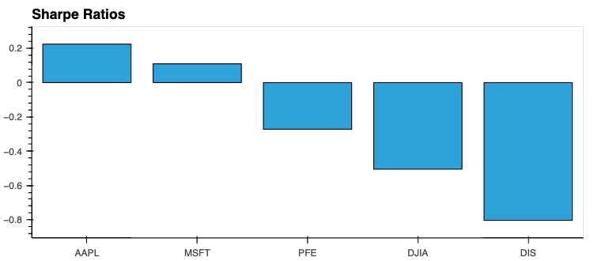
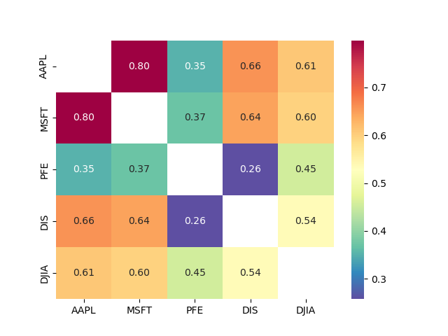
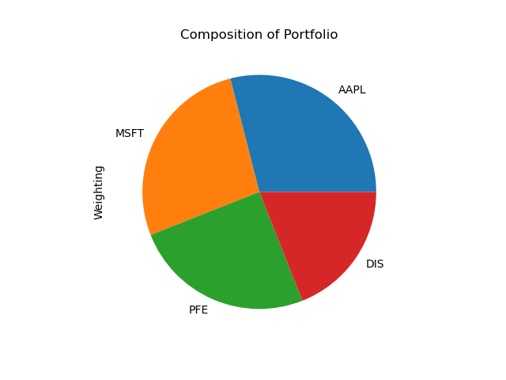

The analysis looked at the performance of a stock portfolio versus the Dow Jones Industrial Average Index. A Monte Carlo simulation was done to see the portfolio's forecasted performance over 30 years.

We'll draw a conclusion as to the best portfolio by examining the following:

1. Returns and Cumulative Returns
2. Standard Deviation
3. Sharpe Ratios
4. Correlation
5. Betas
6. Monte Carlo Simulation

### 1. Returns and Cumulative Returns

The returns were plotted to give a graphical representation of a large dataset but it provides insight into our data. Initially, we found a 75% decline in returns for AAPL but this was caused by a 4-for-1 stock split. Stock split data was obtained through PolygonIO API and applied to the dataset.

Once the returns were thoroughly examined, the cumulative returns were calculated, which shows us which stocks ultimately produce the best returns. The returns from highest to lowest are:

1. AAPL    1.021660
2. MSFT    0.976612
3. PFE     0.891234
4. DIS     0.673126

From this data, AAPL produces the highest return with MSFT very close behind. DIS has the worst return at 0.67.

### 2. Standard Deviation

Standard deviation gives an indication of risk. The higher its value, the more spread out the returns are about its mean. The standard deviations from highest to lowest are:

1. DIS     0.022296
2. MSFT    0.021565
3. AAPL    0.021354
4. PFE     0.015992

The top 3 have very close standard deviations but PFE is fairly lower meaning that it has less risk.

### 3. Sharpe Ratios

Sharpe Ratios measure the amount of returns we receive relative to the risk we assume. Higher values are clearly better. The Sharpe Ratios from highest to lowest are:

1. AAPL    0.224241
2. MSFT    0.109713
3. PFE    -0.271910
4. DIS    -0.803164

It is clear that AAPL has the best reward-to-risk ratio at about 2x MSFT's Sharpe Ratio and the others are below 0.

### 4. Correlation

This gives an indication of diversity by letting us see how linear the relationship is between any 2 investments. Lower values indicate more diversification. AAPL and MSFT are highly correlated as they are both tech sector giants and are also correlated to the DJIA. The DJIA is composed of these 2 stocks so the correlation is expected. DIS is also part of DJIA but it is not as strongly correlated.

### 5. Betas

This is a measurement of volatility relative to the market or in this case, the DJIA index. Lower values indicate lower volatility.

1. PFE     0.83
2. DIS     1.36
3. MSFT    1.47
4. AAPL    1.48

PFE has the lowest volatility versus DJIA but as mentioned it does have a lower return and its Sharpe Ratio is low.

### 6. Monte Carlo Simulation

Since investing is a long term strategy, we use a Monte Carlo Simulation to forecast the results of our investments several years into the future. This uses past performance to predict the future returns, so it must be used carefully. We start our analysis with equal weighting but then use weightings that are proportional to the cumulative returns. For illustration purposes, we use an initial investment of $100,000.

With an equally weighted portfolio, the returns are less than the initial investment. Therefore, the equally weighted portfolio is not acceptable. The portfolio weighted proportionally to the cumulative returns can provide a greater return than the initial investment. The ideal weightings are:

1. AAPL    0.29
2. MSFT    0.27
3. PFE     0.25
4. DIS     0.19

